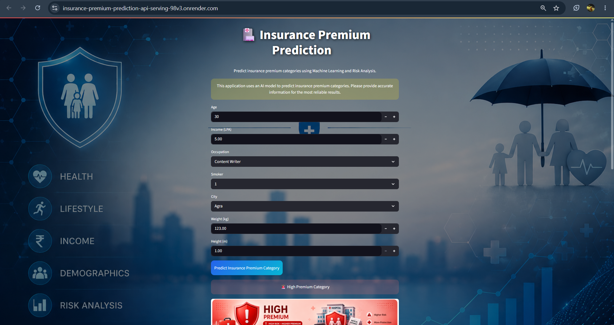
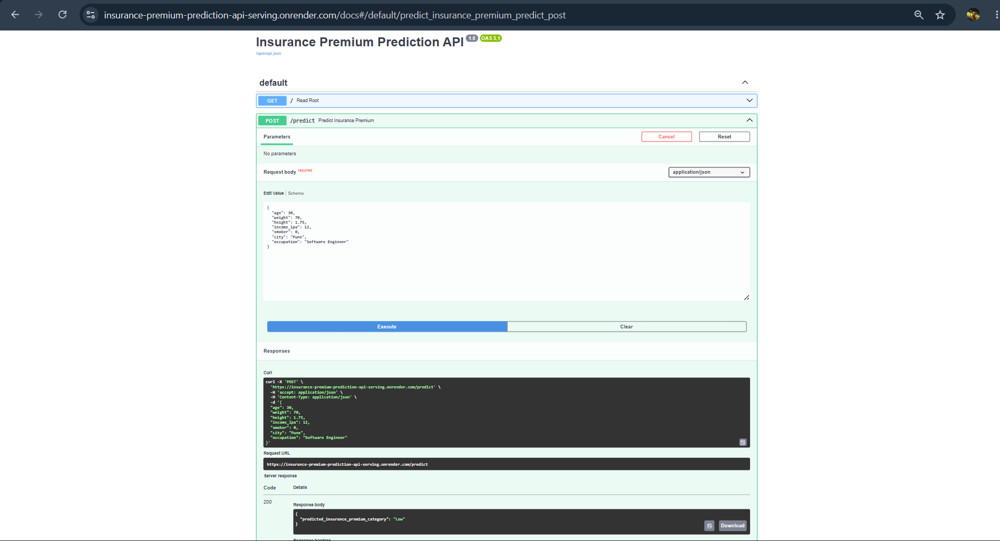

# 🏥 Insurance Premium Prediction API & Serving System
<p align="center">
  
  
  
  
  
  
  
  

  <a href="https://hub.docker.com/r/omikalix/insurance-premium-app">
    
  </a>

  <a href="https://hub.docker.com/r/omikalix/insurance-premium-app">
    
  </a>
</p>

An end-to-end Machine Learning application that predicts insurance premium categories based on customer demographics, lifestyle factors, health indicators, and financial information.

The project follows a complete MLOps-inspired workflow:

* Data Analysis & Feature Engineering
* Random Forest Classification Model
* FastAPI REST API Development
* Pydantic Request Validation
* Interactive Streamlit Frontend
* Cloud Deployment on Render

---

# 🚀 Live Demo

## API Documentation

https://insurance-premium-prediction-api-serving.onrender.com

## Streamlit Application

https://insurance-premium-prediction-api-serving-98v3.onrender.com/

### Getting Started

1. Open the API documentation link first.
2. Wait for the API to respond successfully.
3. Open the Streamlit application.
4. Enter the required details and generate a prediction.

### Note

The backend is hosted on Render and may enter a sleep state after periods of inactivity. The first request may take a little longer while the server wakes up. Once initialized, the application should respond normally.

## 🐳 Docker Image

The project is also available as a Docker image on Docker Hub.

**Docker Hub Repository**

https://hub.docker.com/r/omikalix/insurance-premium-app

### Pull Image

```bash
docker pull omikalix/insurance-premium-app
```

### Run Container

```bash
docker run -p 8000:8000 -p 8501:8501 omikalix/insurance-premium-app
```

### Access Application

* Streamlit UI: http://127.0.0.1:8501
* FastAPI Docs: http://127.0.0.1:8000/docs

> Note: The services listen on `0.0.0.0` inside the container but should be accessed through `127.0.0.1` or `localhost` from your browser.

---
## 📸 Application Screenshots

### 🖥️ Interactive Streamlit Dashboard

<p align="center">

  

</p>

### 🚀 FastAPI Documentation & Testing
<p align="center">

  

</p>

---

# 📌 Project Overview

Insurance companies determine premium categories based on multiple factors such as:

* Age
* BMI
* Smoking Habits
* Income
* Occupation
* City Tier
* Lifestyle Risk

This project leverages Machine Learning to automate premium category prediction.

The model classifies customers into:

| Category  | Meaning                 |
| --------- | ----------------------- |
| 🟢 Low    | Lower insurance risk    |
| 🟡 Medium | Moderate insurance risk |
| 🔴 High   | Higher insurance risk   |

---

# 🏗️ System Architecture

```text
User
  │
  ▼
Streamlit UI
  │
  ▼
FastAPI REST API
  │
  ▼
Random Forest Model (.pkl)
  │
  ▼
Prediction Response
```

---

# 📂 Project Structure

```text
serving-ml-models/
│
├── images/
│   ├── low.png
│   ├── medium.png
│   ├── high.png
│   └── background_image.png
│
├── model.ipynb
├── insurance_premium_model.pkl
├── insurance_premium_api.py
├── UI.py
├── Indian_Insurance_Data.csv
│
├── requirements.txt
└── README.md
```

---

# 📊 Dataset Features

### Original Features

| Feature    | Description      |
| ---------- | ---------------- |
| age        | Customer age     |
| weight     | Weight in kg     |
| height     | Height in meters |
| income_lpa | Annual income    |
| smoker     | Smoking status   |
| city       | Customer city    |
| occupation | Occupation       |

---

# ⚙️ Feature Engineering

The following custom features were created:

### BMI

```python
BMI = weight / (height ** 2)
```

### Income Per Age

```python
income_lpa / age
```

### Weight Height Ratio

```python
weight / height
```

### Income × BMI

```python
income_lpa * bmi
```

### Smoker Income

```python
smoker * income_lpa
```

### Health Risk Index

```python
(bmi * 0.4) + (age * 0.3) + (smoker * 20)
```

### City Tier Classification

```text
Tier 1
Tier 2
Tier 3
```

---

# 🤖 Machine Learning Model

### Algorithm

```python
RandomForestClassifier()
```

### Data Preprocessing

* One Hot Encoding
* Feature Engineering
* Pipeline Architecture
* Column Transformer

### Train Test Split

```python
80% Training
20% Testing
```

---

# 📈 Model Performance

### Classification Report

| Class  | Precision | Recall | F1   |
| ------ | --------- | ------ | ---- |
| High   | 0.91      | 0.90   | 0.91 |
| Low    | 0.91      | 0.93   | 0.92 |
| Medium | 0.88      | 0.87   | 0.87 |

### Overall Metrics

```text
Accuracy        : 89.63%
Macro F1 Score  : 0.90
```

### Cross Validation

```text
Fold 1 : 89.25%
Fold 2 : 89.63%
Fold 3 : 87.25%
Fold 4 : 90.75%
Fold 5 : 91.75%

Mean CV Accuracy : 89.73%
```

---

# 🔥 Feature Importance

Top contributing features:

```text
1. Health Risk Index
2. BMI
3. Age
4. Weight Height Ratio
5. Smoker Income
6. Income (LPA)
7. Income × BMI
8. Income Per Age
```

Key Insight:

Insurance premium category is primarily influenced by:

* Health Risk
* BMI
* Age
* Smoking Status
* Income

while City Tier and Occupation contribute less to prediction.

---

# ⚡ FastAPI Backend

The backend API is developed using:

* FastAPI
* Pydantic
* Uvicorn

### Features

* Request Validation
* JSON Response
* Interactive Swagger Documentation
* Fast Prediction Serving

### API Endpoint

```http
POST /predict
```

### Sample Request

```json
{
  "age": 30,
  "weight": 70,
  "height": 1.75,
  "income_lpa": 12,
  "smoker": 0,
  "city": "Pune",
  "occupation": "Software Engineer"
}
```

### Sample Response

```json
{
  "predicted_insurance_premium_category": "Low"
}
```

---

# 🎨 Streamlit Frontend

The project includes an interactive Streamlit application featuring:

* Modern Insurance Dashboard
* Dynamic Background Design
* Interactive Form Inputs
* Real-Time Predictions
* Personalized Recommendations
* Category-Based Visual Cards

### Premium Category Visualization

🟢 Low Premium

* Low Risk
* High Savings
* Healthy Lifestyle

🟡 Medium Premium

* Balanced Risk
* Balanced Coverage

🔴 High Premium

* Higher Risk
* Enhanced Protection

---

# 💡 Personalized Recommendation Engine

The application generates dynamic recommendations based on:

* BMI
* Age
* Income
* Occupation
* Smoking Status
* Predicted Premium Category

Examples:

```text
🚭 Quit smoking to reduce risk.

🏃 Maintain a healthy BMI.

🩺 Schedule annual checkups.

💰 Build an emergency healthcare fund.
```

---

# 🛠️ Installation

Clone Repository

```bash
git clone https://github.com/yourusername/insurance-premium-prediction.git
```

Move into Project

```bash
cd insurance-premium-prediction
```

Install Dependencies

```bash
pip install -r requirements.txt
```

---

# ▶️ Run FastAPI Server

```bash
uvicorn insurance_premium_api:app --reload
```

API Docs

```text
http://127.0.0.1:8000/docs
```

---

# ▶️ Run Streamlit UI

```bash
streamlit run UI.py
```

---

# ☁️ Deployment

This project is fully deployed on Render.

### Services

✅ FastAPI Backend

✅ Streamlit Frontend

### Deployment Stack

* Render
* FastAPI
* Streamlit
* Uvicorn
* Random Forest Model

---

# 👨‍💻 Author

**OMKAR SAWANT**

Building intelligent machine learning systems with scalable deployment architectures.
---
Dataset: **Health Insurance Dataset** by **Parth Patel**  
Source: https://www.kaggle.com/datasets/patelparth3399/indian-insurance-premium-prediction-dataset 

License: MIT

Special thanks to the author for making the dataset publicly available.
---
